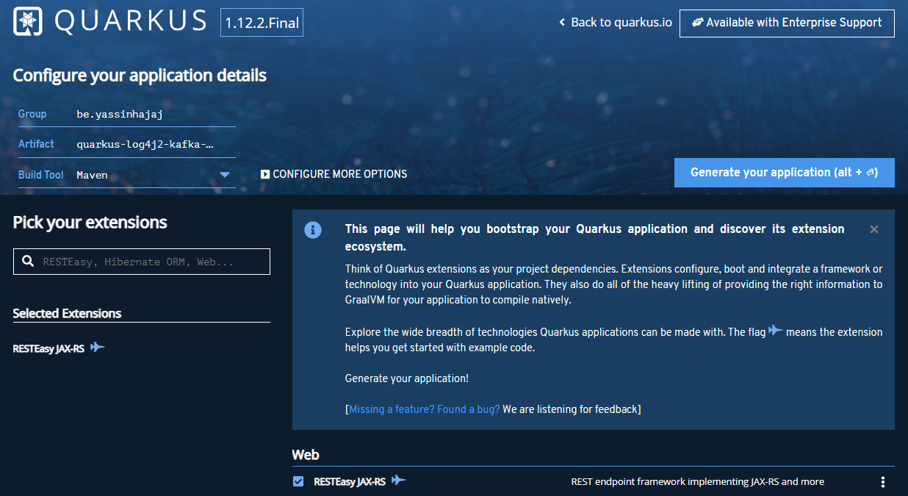
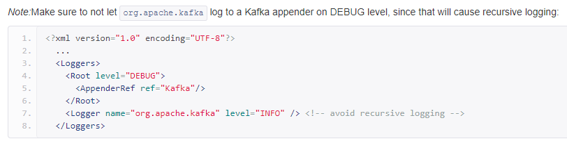

# Logs from Quarkus to Kibana through Kafka

In this article, we'll see how we can produce logs and read them in a dashboard using the following technologies:

* Quarkus
* Log4j2
* Apache Kafka
* Kafka-Connect
* ElasticSearch
* Kibana
* Docker-Compose

## Quarkus

We'll first need to generate a Quarkus application.

In fact, any kind of application will do, at least if it uses Maven, but for conveniency, let's use the same app.

Let's start by navigating to [https://code.quarkus.io/](https://code.quarkus.io/) and generate an application
using [RESTEasy JAX-RS](https://docs.jboss.org/resteasy/docs/3.0.19.Final/userguide/html_single/index.html).



## Log4j2

### Dependency

Now that the application is generated, we'll continue by adding the `log4j2` dependency

```
<dependency>
    <groupId>org.apache.logging.log4j</groupId>
    <artifactId>log4j-core</artifactId>
    <version>2.7</version>
</dependency>
```

### GreetingResource.java

Now we've done that, we'll modify the class `GreetingResource.java` file and add some logging to it

```
@Path("/hello-resteasy")
public class GreetingResource {

    private static final Logger logger = LogManager.getLogger(GreetingResource.class);

    @GET
    @Produces(MediaType.TEXT_PLAIN)
    public String hello() {
        logger.info("Hello called");
        return "Hello RESTEasy";
    }

    @GET
    @Path("error")
    @Produces(MediaType.TEXT_PLAIN)
    public String error() {
        logger.error("Error called");
        return "Error";
    }
}
```

This simply means that, after log4j2 is configured, whenever we'll call `/hello-resteasy`, `Hello called` will get
printed to the console.

And whenever we'll call `/hello-resteasy/error`, `Error called` will get printed to the console.

That might seem nice, but that's not exactly what we want.

We want to integrate with `ElasticSearch`, and it only accepts `JSON` as inputs.

### Log4j2's JsonLayout for Appenders

Luckily enough, `log4j2` comes with a type of layout producing `JSON`.

We'll only need to configure `log4j2` in the following way

```
<?xml version="1.0" encoding="UTF-8"?>
<Configuration status="DEBUG">
    <Appenders>
        <Kafka name="Kafka" topic="quarkus-logs">
            <JsonLayout complete="false" locationInfo="true" properties="true" propertiesAsList="true" eventEol="true"/>
            <Property name="bootstrap.servers">${env:KAFKA_BOOTSTRAP_SERVER}</Property>
            <Property name="acks">0</Property>
        </Kafka>
    </Appenders>
    <Loggers>
        <Root level="debug">
            <AppenderRef ref="Kafka"/>
        </Root>
        <Logger name="org.apache.kafka" level="INFO"/>
    </Loggers>
</Configuration>
```

We notice that the `log4j2` appender used is the `KafkaAppender` which will serve as a `Kafka Consumer` out-of-the-box.

The properties used are:

* `bootstrap.servers` : This serves to point to our broker. It will help create the topic and write to it
* `acks` : set at 0 (equivalent to shoot and forget), meaning there is no acknowledgment of message receival. For logs,
  as they're not crucial, it's not needed to have strong delivery guarantees.

We can also notice the usage of `<Logger name="org.apache.kafka" level="INFO"/>` to avoid recursive logging.

It comes from
the [official documentation](https://logging.apache.org/log4j/log4j-2.4/manual/appenders.html#KafkaAppender).



To make the `JsonLayout` and the `KafkaAppender` work, we'll need to use the following Maven dependencies too

```
<dependency>
    <groupId>org.apache.kafka</groupId>
    <artifactId>kafka-clients</artifactId>
    <version>2.7.0</version>
</dependency>
<dependency>
    <groupId>com.fasterxml.jackson.core</groupId>
    <artifactId>jackson-core</artifactId>
    <version>2.12.2</version>
</dependency>
<dependency>
    <groupId>com.fasterxml.jackson.core</groupId>
    <artifactId>jackson-databind</artifactId>
    <version>2.12.2</version>
</dependency>
```

And as the last step, we'll use the jvm `Dockerfile` provided by Quarkus and build our image

`docker build -f src/main/docker/Dockerfile.jvm -t quarkus/quarkus-log4j2-kafka-elk-jvm .`

## Apache Kafka

Now that we have configured the application, we'll create our `docker-compose.yml` file and start adding our building
blocks to it.

```
version: '2.1'

services:
   -> we'll add the following building blocks here <-
```

### ZooKeeper & Kafka Broker

For this, we'll just reuse the docker-compose
from [Stephane Maarek's Conduktor](https://github.com/conduktor/kafka-stack-docker-compose)

If you reuse it and want to use your own namings, don't forget to change those in there at all places

```
zookeeper-container:
  image: zookeeper:3.4.9
  hostname: zookeeper-container
  container_name: zookeeper-container
  ports:
    - "2181:2181"
  environment:
    ZOO_MY_ID: 1
    ZOO_PORT: 2181
    ZOO_SERVERS: server.1=zookeeper-container:2888:3888

kafka-broker:
  image: confluentinc/cp-kafka:5.5.1
  hostname: kafka-broker
  container_name: kafka-broker
  ports:
    - "9092:9092"
  environment:
    KAFKA_ADVERTISED_LISTENERS: LISTENER_DOCKER_INTERNAL://kafka-broker:19092,LISTENER_DOCKER_EXTERNAL://${DOCKER_HOST_IP:-127.0.0.1}:9092
    KAFKA_LISTENER_SECURITY_PROTOCOL_MAP: LISTENER_DOCKER_INTERNAL:PLAINTEXT,LISTENER_DOCKER_EXTERNAL:PLAINTEXT
    KAFKA_INTER_BROKER_LISTENER_NAME: LISTENER_DOCKER_INTERNAL
    KAFKA_ZOOKEEPER_CONNECT: "zookeeper-container:2181"
    KAFKA_BROKER_ID: 1
    KAFKA_LOG4J_LOGGERS: "kafka.controller=ERROR,kafka.producer.async.DefaultEventHandler=ERROR,state.change.logger=ERROR"
    KAFKA_OFFSETS_TOPIC_REPLICATION_FACTOR: 1
  depends_on:
    - zookeeper-container
```

### Quarkus Application

Now that we've done that, we'll configure minimastically the Quarkus application

```
quarkus:
  image: quarkus/quarkus-log4j2-kafka-elk-jvm
  hostname: quarkus
  container_name: quarkus
  ports:
    - "8082:8080"
  environment:
    KAFKA_BOOTSTRAP_SERVER: kafka-broker:19092
  depends_on:
    - kafka-broker
```

You noticed the environment variable `KAFKA_BOOTSTRAP_SERVER`, if you remember correctly from our `log4j2`, we had the following configuration which uses this environment variable:

`<Property name="bootstrap.servers">${env:KAFKA_BOOTSTRAP_SERVER}</Property>`

### Time to test this !

Now that this is done, we'll test it.

Then, of course, we'll continue with Kafka-Connect, ElasticSearch and Kibana.

Let's start by doing two `curl`

```
$ curl http://localhost:8082/hello-resteasy
$ curl http://localhost:8082/hello-resteasy/error
```

Now, that is done, we should find our logs back in the topic. Let's check !

```
docker exec -it "kafka-broker" kafka-console-consumer --topic quarkus-logs --bootstrap-server localhost:9092 --from-beginning
```

This should print the following

```
{
  "timeMillis" : 1615852382532,
  "thread" : "executor-thread-1",
  "level" : "INFO",
  "loggerName" : "be.yh.GreetingResource",
  "message" : "Hello called",
  "endOfBatch" : false,
  "loggerFqcn" : "org.apache.logging.log4j.spi.AbstractLogger",
  "contextMap" : [ ],
  "threadId" : 17,
  "threadPriority" : 5,
  "source" : {
    "class" : "be.yh.GreetingResource",
    "method" : "hello",
    "file" : "GreetingResource.java",
    "line" : 19
  }
}

{
  "timeMillis" : 1615852387316,
  "thread" : "executor-thread-1",
  "level" : "ERROR",
  "loggerName" : "be.yh.GreetingResource",
  "message" : "Error called",
  "endOfBatch" : false,
  "loggerFqcn" : "org.apache.logging.log4j.spi.AbstractLogger",
  "contextMap" : [ ],
  "threadId" : 17,
  "threadPriority" : 5,
  "source" : {
    "class" : "be.yh.GreetingResource",
    "method" : "error",
    "file" : "GreetingResource.java",
    "line" : 27
  }
}
```

Success !


## ElasticSearch

## Kibana

[https://code.quarkus.io/]: https://code.quarkus.io/