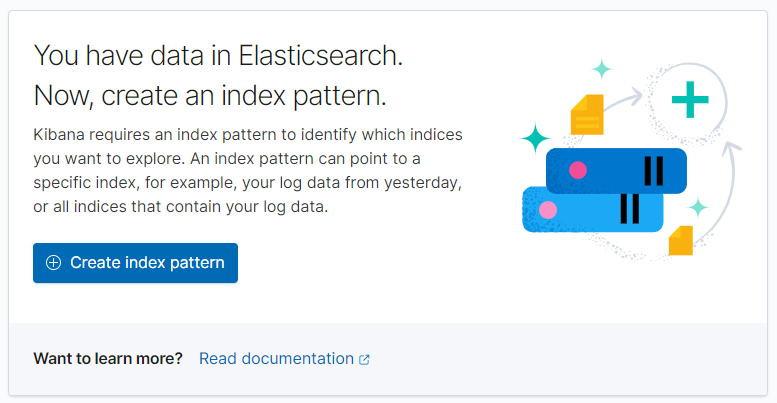

# Logs from Quarkus to Kibana through Kafka in less than 15 minutes

In this article, we'll see how we can produce logs and read them in a dashboard using the following technologies:

* Quarkus
* Log4j2
* Apache Kafka
* Kafka-Connect
* ElasticSearch
* Kibana
* Docker-Compose

## Quarkus

We'll first need to generate a Quarkus application.

In fact, any kind of application will do, at least if it uses Maven, but for conveniency, let's use the same app.

Let's start by navigating to [https://code.quarkus.io/](https://code.quarkus.io/) and generate an application
using [RESTEasy JAX-RS](https://docs.jboss.org/resteasy/docs/3.0.19.Final/userguide/html_single/index.html).


## Log4j2

### Dependency

Now that the application is generated, we'll continue by adding the `log4j2` dependency

```
<dependency>
    <groupId>org.apache.logging.log4j</groupId>
    <artifactId>log4j-core</artifactId>
    <version>2.7</version>
</dependency>
```

### GreetingResource.java

Now we've done that, we'll modify the class `GreetingResource.java` file and add some logging to it

```
@Path("/hello-resteasy")
public class GreetingResource {

    private static final Logger logger = LogManager.getLogger(GreetingResource.class);

    @GET
    @Produces(MediaType.TEXT_PLAIN)
    public String hello() {
        logger.info("Hello called");
        return "Hello RESTEasy";
    }

    @GET
    @Path("error")
    @Produces(MediaType.TEXT_PLAIN)
    public String error() {
        logger.error("Error called");
        return "Error";
    }
}
```

This simply means that, after log4j2 is configured, whenever we'll call `/hello-resteasy`, `Hello called` will get
printed to the console.

And whenever we'll call `/hello-resteasy/error`, `Error called` will get printed to the console.

That might seem nice, but that's not exactly what we want.

We want to integrate with `ElasticSearch`, and it only accepts `JSON` as inputs.

### Log4j2's JsonLayout for Appenders

Luckily enough, `log4j2` comes with a type of layout producing `JSON`.

We'll only need to configure `log4j2` in the following way

```
<?xml version="1.0" encoding="UTF-8"?>
<Configuration status="DEBUG">
    <Appenders>
        <Kafka name="Kafka" topic="quarkus-logs">
            <JsonLayout complete="false" locationInfo="true" properties="true" propertiesAsList="true" eventEol="true"/>
            <Property name="bootstrap.servers">${env:KAFKA_BOOTSTRAP_SERVER}</Property>
            <Property name="acks">0</Property>
        </Kafka>
    </Appenders>
    <Loggers>
        <Root level="debug">
            <AppenderRef ref="Kafka"/>
        </Root>
        <Logger name="org.apache.kafka" level="INFO"/>
    </Loggers>
</Configuration>
```

We notice that the `log4j2` appender used is the `KafkaAppender` which will serve as a `Kafka Consumer` out-of-the-box.

The properties used are:

* `bootstrap.servers` : This serves to point to our broker. It will help create the topic and write to it
* `acks` : set at 0 (equivalent to shoot and forget), meaning there is no acknowledgment of message receival. For logs,
  as they're not crucial, it's not needed to have strong delivery guarantees.

We can also notice the usage of `<Logger name="org.apache.kafka" level="INFO"/>` to avoid recursive logging.

It comes from
the [official documentation](https://logging.apache.org/log4j/log4j-2.4/manual/appenders.html#KafkaAppender).


To make the `JsonLayout` and the `KafkaAppender` work, we'll need to use the following Maven dependencies too

```
<dependency>
    <groupId>org.apache.kafka</groupId>
    <artifactId>kafka-clients</artifactId>
    <version>2.7.0</version>
</dependency>
<dependency>
    <groupId>com.fasterxml.jackson.core</groupId>
    <artifactId>jackson-core</artifactId>
    <version>2.12.2</version>
</dependency>
<dependency>
    <groupId>com.fasterxml.jackson.core</groupId>
    <artifactId>jackson-databind</artifactId>
    <version>2.12.2</version>
</dependency>
```

And as the last step, we'll use the jvm `Dockerfile` provided by Quarkus and build our image

`docker build -f src/main/docker/Dockerfile.jvm -t quarkus/quarkus-log4j2-kafka-elk-jvm .`

## Apache Kafka

Now that we have configured the application, we'll create our `docker-compose.yml` file and start adding our building
blocks to it.

```
version: '2.1'

services:
   -> we'll add the following building blocks here <-
```

### ZooKeeper & Kafka Broker

For this, we'll just reuse the docker-compose
from [Stephane Maarek's Conduktor](https://github.com/conduktor/kafka-stack-docker-compose)

If you reuse it and want to use your own namings, don't forget to change those in there at all places

```
zookeeper-container:
  image: zookeeper:3.4.9
  hostname: zookeeper-container
  container_name: zookeeper-container
  ports:
    - "2181:2181"
  environment:
    ZOO_MY_ID: 1
    ZOO_PORT: 2181
    ZOO_SERVERS: server.1=zookeeper-container:2888:3888
  restart: always

kafka-broker:
  image: confluentinc/cp-kafka:5.5.1
  hostname: kafka-broker
  container_name: kafka-broker
  ports:
    - "9092:9092"
  environment:
    KAFKA_ADVERTISED_LISTENERS: LISTENER_DOCKER_INTERNAL://kafka-broker:19092,LISTENER_DOCKER_EXTERNAL://${DOCKER_HOST_IP:-127.0.0.1}:9092
    KAFKA_LISTENER_SECURITY_PROTOCOL_MAP: LISTENER_DOCKER_INTERNAL:PLAINTEXT,LISTENER_DOCKER_EXTERNAL:PLAINTEXT
    KAFKA_INTER_BROKER_LISTENER_NAME: LISTENER_DOCKER_INTERNAL
    KAFKA_ZOOKEEPER_CONNECT: "zookeeper-container:2181"
    KAFKA_BROKER_ID: 1
    KAFKA_LOG4J_LOGGERS: "kafka.controller=ERROR,kafka.producer.async.DefaultEventHandler=ERROR,state.change.logger=ERROR"
    KAFKA_OFFSETS_TOPIC_REPLICATION_FACTOR: 1
  depends_on:
    - zookeeper-container
  restart: always
```

### Quarkus Application

Now that we've done that, we'll configure minimastically the Quarkus application

```
quarkus:
  image: quarkus/quarkus-log4j2-kafka-elk-jvm
  hostname: quarkus
  container_name: quarkus
  ports:
    - "8082:8080"
  environment:
    KAFKA_BOOTSTRAP_SERVER: kafka-broker:19092
  depends_on:
    - kafka-broker
  restart: always
```

You noticed the environment variable `KAFKA_BOOTSTRAP_SERVER`, if you remember correctly from our `log4j2`, we had the
following configuration which uses this environment variable:

`<Property name="bootstrap.servers">${env:KAFKA_BOOTSTRAP_SERVER}</Property>`

### Time to test this !

Now that this is done, we'll test it.

Run the containers

`$ docker-compose -f docker-compose.yml up`

Let's continue by doing two `curl`

```
$ curl http://localhost:8082/hello-resteasy
$ curl http://localhost:8082/hello-resteasy/error
```

Now, that is done, we should find our logs back in the topic. Let's check !

```
$ docker exec -it "kafka-broker" \
  kafka-console-consumer \
  --topic quarkus-logs \
  --bootstrap-server localhost:9092 \
  --from-beginning
```

This should print the following

```
{
  "timeMillis" : 1615852382532,
  "thread" : "executor-thread-1",
  "level" : "INFO",
  "loggerName" : "be.yh.GreetingResource",
  "message" : "Hello called",
  "endOfBatch" : false,
  "loggerFqcn" : "org.apache.logging.log4j.spi.AbstractLogger",
  "contextMap" : [ ],
  "threadId" : 17,
  "threadPriority" : 5,
  "source" : {
    "class" : "be.yh.GreetingResource",
    "method" : "hello",
    "file" : "GreetingResource.java",
    "line" : 19
  }
}

{
  "timeMillis" : 1615852387316,
  "thread" : "executor-thread-1",
  "level" : "ERROR",
  "loggerName" : "be.yh.GreetingResource",
  "message" : "Error called",
  "endOfBatch" : false,
  "loggerFqcn" : "org.apache.logging.log4j.spi.AbstractLogger",
  "contextMap" : [ ],
  "threadId" : 17,
  "threadPriority" : 5,
  "source" : {
    "class" : "be.yh.GreetingResource",
    "method" : "error",
    "file" : "GreetingResource.java",
    "line" : 27
  }
}
```

Success !


Then, of course, we'll continue with `ElasticSearch`, `Kafka-Connect` and `Kibana`.

## ElasticSearch

We'll use the following Docker compose configuration to run our `ElasticSearch`

```
elasticsearch:
  image: docker.elastic.co/elasticsearch/elasticsearch:7.11.2
  container_name: elasticsearch
  ports:
    - 9200:9200
  environment:
    - discovery.type=single-node
  restart: always
```

Nothing else to be done !
It will now be part of our containers once the Docker compose is ran again !

## Kafka-Connect

Kafka Connect helps us integrate Kafka with third party software smoothly.

We'll use the `cp-kafka-connect` Docker image, it contains the `ElasticsearchSinkConnector` which will come in handy to
integrate and flush data inside ElasticSearch.

Let's check the Docker compose configuration

```
kafka-connect:
  image: confluentinc/cp-kafka-connect:3.3.0
  hostname: kafka-connect
  container_name: kafka-connect
  depends_on:
    - zookeeper-container
    - kafka-broker
  ports:
    - "8083:8083"
  environment:
    CONNECT_BOOTSTRAP_SERVERS: 'kafka-broker:19092'
    CONNECT_REST_ADVERTISED_HOST_NAME: connect
    CONNECT_REST_PORT: 8083
    CONNECT_GROUP_ID: compose-connect-group
    CONNECT_CONFIG_STORAGE_TOPIC: docker-connect-configs
    CONNECT_CONFIG_STORAGE_REPLICATION_FACTOR: 1
    CONNECT_OFFSET_STORAGE_TOPIC: docker-connect-offsets
    CONNECT_OFFSET_STORAGE_REPLICATION_FACTOR: 1
    CONNECT_STATUS_STORAGE_TOPIC: docker-connect-status
    CONNECT_STATUS_STORAGE_REPLICATION_FACTOR: 1
    CONNECT_ZOOKEEPER_CONNECT: 'zookeeper-container:2181'
    CONNECT_KEY_CONVERTER: org.apache.kafka.connect.json.JsonConverter
    CONNECT_VALUE_CONVERTER: org.apache.kafka.connect.json.JsonConverter
    CONNECT_VALUE_CONVERTER_SCHEMAS_ENABLE: 'false'
    CONNECT_KEY_CONVERTER_SCHEMAS_ENABLE: 'false'
    CONNECT_INTERNAL_KEY_CONVERTER: org.apache.kafka.connect.json.JsonConverter
    CONNECT_INTERNAL_VALUE_CONVERTER: org.apache.kafka.connect.json.JsonConverter
    CONNECT_LOG4J_LOGGERS: org.apache.kafka.connect=DEBUG
  restart: always
```

It is very important to add the following to make sure Kafka Connect does not complain about a lack of schemas

```
CONNECT_VALUE_CONVERTER_SCHEMAS_ENABLE: 'false'
CONNECT_KEY_CONVERTER_SCHEMAS_ENABLE: 'false'
```

Once we'll be running the containers again, we'll need to create our connector

```
$ curl -X POST http://localhost:8083/connectors -H "Content-Type: application/json" -d '{
     "name":"quarkus-logs-elasticsearch-connector",
     "config":{
        "connector.class":"io.confluent.connect.elasticsearch.ElasticsearchSinkConnector",
        "connection.url":"http://elasticsearch:9200",
        "tasks.max":"1",
        "topics":"quarkus-logs",
        "type.name":"_doc",
        "name":"quarkus-logs-elasticsearch-connector",
        "value.converter":"org.apache.kafka.connect.json.JsonConverter",
        "value.converter.schemas.enable":"false",
        "key.converter.schemas.enable":"false",
        "schemas.enable":"false",
        "schema.ignore":"true",
        "key.ignore":"true"
     }
  }'
```

Make sure the connector is created by doing a second `curl`

`$ curl localhost:8083/connectors`

And see if the `quarkus-logs-elasticsearch-connector` appears in the response

### Test again !

Now that we've set up `ElasticSearch` and its Kafka Connector, let's test !

Run the containers

`$ docker-compose -f docker-compose.yml up`

Then two `curl`

```
$ curl http://localhost:8082/hello-resteasy
$ curl http://localhost:8082/hello-resteasy/error
```

And now, instead of checking the messages in Kafka, we'll directly target the `ElasticSearch` index

```
$ curl localhost:9200/quarkus-logs/_search
```

And the following is printed to the console and proves our integration with `ElasticSearch` is working !

```
{
   "took":70,
   "timed_out":false,
   "_shards":{
      "total":1,
      "successful":1,
      "skipped":0,
      "failed":0
   },
   "hits":{
      "total":{
         "value":2,
         "relation":"eq"
      },
      "max_score":1.0,
      "hits":[
         {
            "_index":"quarkus-logs",
            "_type":"_doc",
            "_id":"quarkus-logs+0+0",
            "_score":1.0,
            "_source":{
               "threadId":17,
               "loggerFqcn":"org.apache.logging.log4j.spi.AbstractLogger",
               "level":"INFO",
               "endOfBatch":false,
               "thread":"executor-thread-1",
               "source":{
                  "file":"GreetingResource.java",
                  "method":"hello",
                  "line":19,
                  "class":"be.yh.GreetingResource"
               },
               "loggerName":"be.yh.GreetingResource",
               "message":"Hello called",
               "contextMap":[
                  
               ],
               "threadPriority":5,
               "timeMillis":1615854266772
            }
         },
         {
            "_index":"quarkus-logs",
            "_type":"_doc",
            "_id":"quarkus-logs+0+1",
            "_score":1.0,
            "_source":{
               "threadId":17,
               "loggerFqcn":"org.apache.logging.log4j.spi.AbstractLogger",
               "level":"ERROR",
               "endOfBatch":false,
               "thread":"executor-thread-1",
               "source":{
                  "file":"GreetingResource.java",
                  "method":"error",
                  "line":27,
                  "class":"be.yh.GreetingResource"
               },
               "loggerName":"be.yh.GreetingResource",
               "message":"Error called",
               "contextMap":[
                  
               ],
               "threadPriority":5,
               "timeMillis":1615854267944
            }
         }
      ]
   }
}
```

## Kibana

Now that our communication is established between the Quarkus' application logs and `ElasticSearch`, we'll want to
display them on a screen.

The Elastic stack comes with `Kibana`.

### Configuration

```
kibana:
  image: docker.elastic.co/kibana/kibana:7.11.2
  container_name: kibana
  ports:
    - 5601:5601
  environment:
    ELASTICSEARCH_URL: http://elasticsearch:9200
    ELASTICSEARCH_HOSTS: '["http://elasticsearch:9200"]'
  depends_on:
    - elasticsearch
```

### User Interface

Now that `Kibana` is configured, we'll run our containers again

`$ docker-compose -f docker-compose.yml up`

Once this is done, we'll access `Kibana` through [http://localhost:5601](http://localhost:5601)

If everything went well, we'll land on the following page


Now, we'll continue with creating an Index Pattern through the Stack Management menu on the left


Let's create the index pattern !




You can now explore the data !


We did it ! 😁

